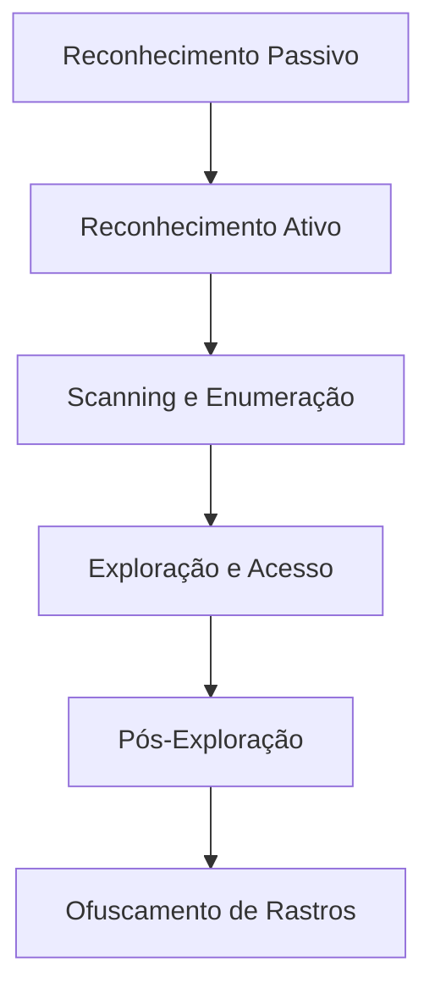
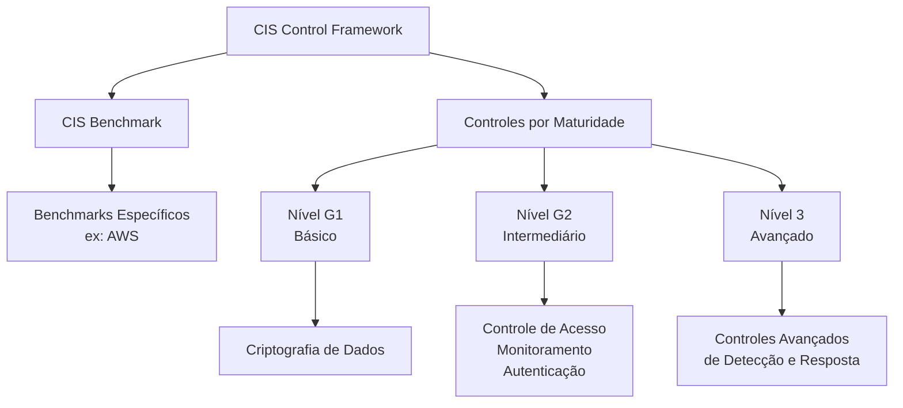
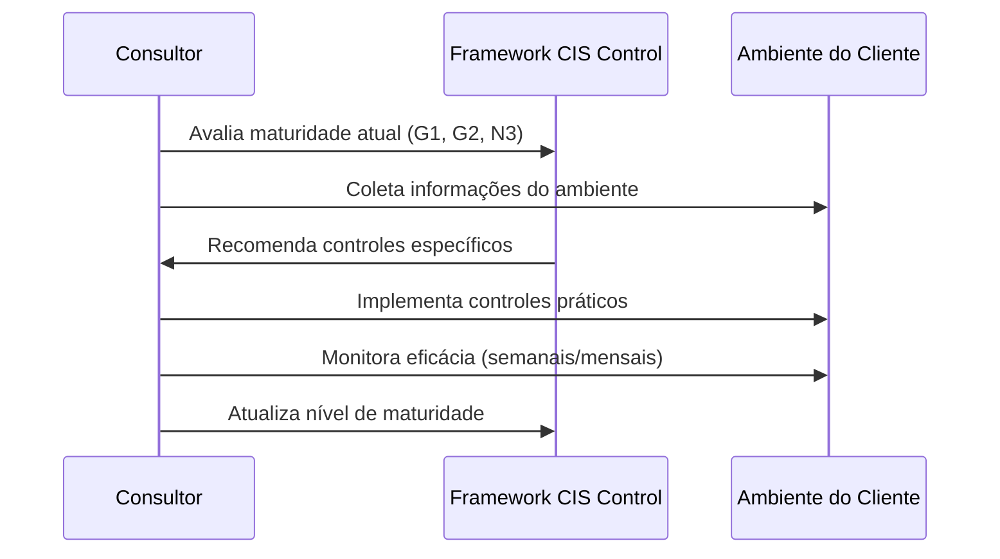
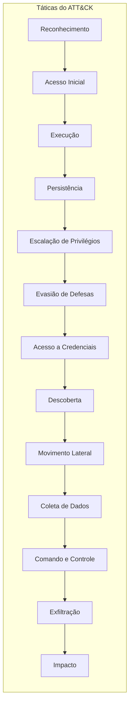

# Segurança da Informação 🔐

## Fundamentos da Segurança da Informação

### Pilares da Segurança da Informação (Tríade CIA)
A base da segurança da informação repousa sobre três princípios fundamentais, conhecidos como CIA:

- Confidencialidade: Garantir que a informação seja acessível apenas a pessoas autorizadas.

- Integridade: Manter a precisão e completude dos dados, prevenindo alterações não autorizadas.

- Disponibilidade: Assegurar que os sistemas e dados estejam acessíveis aos usuários sempre que necessário.

A violação de qualquer um desses pilares cria vulnerabilidades críticas.

### Por que a Segurança é Crucial?
A informação é um ativo valioso (dados, conversas, documentos) e sua perda ou vazamento pode causar danos financeiros e reputacionais graves para empresas e indivíduos. O volume massivo de dados trafegados na internet (ex.: milhões de mensagens por minuto) torna a proteção uma necessidade absoluta.

### O Equilíbrio Essencial
Um sistema eficaz deve encontrar o ponto ideal entre:

- Funcionalidade: O que o sistema faz.

- Usabilidade: A facilidade de uso.

- Segurança: A proteção dos dados.
  
A segurança não deve ser um obstáculo, mas uma aliada integrada que protege sem comprometer a experiência do usuário (ex.: usando autenticação multifator de forma inteligente).

### O que é Cibersegurança?
É a prática de proteger sistemas, redes e dados em ambientes digitais. Sua evolução acompanhou a tecnologia:

- Anos 80-90: Surgimento de antivírus e firewalls.

- Anos 2000: Adoção de políticas e normas (ex.: ISO 27001).

- 2010 em diante: Foco em segurança em nuvem (Cloud Security), BYOD (Bring Your Own Device) e frameworks como Zero Trust (confiança zero) e DevSecOps (integração da segurança no desenvolvimento de software).

### Tendências e Boas Práticas Modernas
- DevSecOps: Integrar controles de segurança em todas as etapas do ciclo de desenvolvimento de software.

- Zero Trust: Nunca confiar, sempre verificar. Conceder o mínimo privilégio necessário aos usuários.

- Conformidade Legal: Adequação à leis de proteção de dados como LGPD (Brasil) e GDPR (Europa).

- Segurança em IA: Novos desafios e camadas de proteção com o uso massivo de modelos de Inteligência Artificial.

---

### Pilares da Segurança da Informação - CIA

#### **1. Confidencialidade** 🔒
*   **O que é:** Garantia de que a informação só é acessível por pessoas ou sistemas autorizados.
*   **Exemplo Prático:** O acesso à sua conta bancária online é protegido por login, senha e, muitas vezes, um token (2FA). Sem essas credenciais, os dados (como seu saldo) devem permanecer inacessíveis.
*   **Riscos:** Quebras de confidencialidade permitem que invasores acessem dados sensíveis indevidamente, através de métodos como engenharia social ou manipulação de URLs.
*   **Como Garantir:**
    *   Utilizando autenticação robusta (senhas fortes).
    *   Implementando **Autenticação Multifator (MFA)** com tokens, biometria ou aplicativos autenticadores.
    *   Adotando o princípio de menor privilégio.

#### **2. Integridade** ✅
*   **O que é:** Garantia de que os dados estão completos, precisos e não foram alterados de forma não autorizada.
*   **Exemplo Prático:** Senhas nunca devem ser armazenadas em texto puro, mas sim como **hashes** (valores irreversíveis). Se um invasor modificar o hash no banco de dados, a integridade é violada e o acesso pode ser comprometido.
*   **Como Garantir:**
    *   Uso de funções de **hash** criptográficas (ex: SHA-256) para verificar a autenticidade de dados e arquivos.
    *   Verificação de hashes de arquivos baixados (ex: ISOs de sistemas operacionais) comparando o valor calculado com o fornecido pelo distribuidor.
    *   Uso de **assinaturas digitais** para verificar a autoria e a não alteração de documentos.

#### **3. Disponibilidade** ⏱️
*   **O que é:** Garantia de que os sistemas e dados estarão acessíveis para usuários autorizados quando necessário.
*   **Exemplo Prático:** Um ataque de **negação de serviço (DDoS)** que derruba um site é uma violação direta da disponibilidade.
*   **Como Garantir:**
    *   Implementação de redundância (servidores em cluster).
    *   Uso de **balanceadores de carga** para distribuir tráfego e evitar sobrecarga.
    *   Planos de recuperação de desastres (backups).

---

### **Conclusão**
A tríade **CIA** forma a base da segurança da informação:
*   Use **autenticação forte e MFA** para garantir a **Confidencialidade**.
*   Use **hashes e assinaturas** para garantir a **Integridade**.
*   Use **redundância e balanceamento** para garantir a **Disponibilidade**.

O equilíbrio entre esses três pilares é essencial para proteger ativos de informação contra ameaças e vulnerabilidades.

---

### Autenticidade, Não Repúdio e Auditoria (ANA)

#### **1. Autenticidade 🛡️**
*   **O que é:** Garantia de que uma informação ou ação é genuína e originada de uma fonte confiável e verificável.
*   **Como Garantir:**
    *   **Assinaturas Digitais:** Tecnologias como **DocuSign** provam que uma pessoa específica executou uma ação (ex: assinou um documento).
*   **Relação com a Integridade:** Se uma informação for modificada, ela perde sua autenticidade e confiabilidade.

#### **2. Não Repúdio (Non-Repudiation) 📝**
*   **O que é:** Princípio que impede um indivíduo de negar ter realizado uma ação. Fornece **prova irrefutável** da autoria de um evento.
*   **Como Garantir:**
    *   **Assinaturas Digitais:** Servem como uma prova de não repúdio.
    *   **Logs de Auditoria Robustos:** Registros detalhados que capturam "quem", "o quê", "quando" e "onde" de uma ação.

#### **3. Auditoria (Auditing) & Rastreabilidade 🔍**
*   **O que é:** A prática de **monitorar e registrar** eventos para criar um histórico de atividades. É a base para o não repúdio e a responsabilização.
*   **Por que é Crítica:** Sem logs, é impossível provar quem executou uma ação, investigar incidentes ou detectar comportamentos maliciosos.
*   **Exemplo Prático (API Flask):**
    Um log básico de uma API `127.0.0.1 - - [09/Jul/2025 23:30:33] "GET /api/hello HTTP/1.1" 200 -` é um começo, mas é insuficiente. Logs devem ser enriquecidos com:
    *   Identidade do usuário (não apenas IP).
    *   Ação específica realizada.
    *   Recursos acessados.
    *   Timestamp.
    *   Status da operação.

#### **4. Responsabilização (Accountability) 👤**
*   **O que é:** A consequência direta de uma auditoria eficaz. É a capacidade de **atribuir ações a um indivíduo** específico, tornando-o responsável por suas atividades no sistema.
*   **Objetivo:** Permite rastrear comportamentos, responder a incidentes e proteger contra negações fraudulentas de ações.

### Princípios-Chave

*   **A CIA não é suficiente:** Para segurança robusta, os pilares **Confidencialidade, Integridade e Disponibilidade** devem ser expandidos com **Autenticidade, Não Repúdio e Auditoria**.
*   **Logs são a prova:** A frase **"Sem log, não há prova"** é fundamental. Logs detalhados são a base para a auditoria e o não repúdio.
*   **Pense além dos erros:** Ao construir sistemas, não registre apenas falhas. **Registre todas as ações significativas** para permitir a rastreabilidade completa (accountability).
*   **A quebra desses princípios cria vulnerabilidades críticas,** pois impossibilita a investigação e a responsabilização, deixando sistemas expostos.

---

### Fundamentos do Zero Trust (Confiança Zero)

#### **🔐 Visão Geral**
O **Zero Trust** é um modelo de segurança moderno baseado em um princípio fundamental: **"Nunca confie, sempre verifique"**. Ele abandona o conceito tradicional de uma rede corporativa interna "confiável" e trata **todo usuário e dispositivo**, independente de sua localização (interno ou externo à rede), como uma potencial ameaça até que sua identidade e acesso sejam rigorosamente validados.

#### **🛡️ Princípios Centrais**
1.  **Verificação Contínua:** Toda tentativa de acesso a qualquer recurso deve ser autenticada, autorizada e criptografada. A confiança nunca é concedida permanentemente.
2.  **Privilégio Mínimo (Least Privilege):** Os usuários e dispositivos recebem **apenas as permissões estritamente necessárias** para realizar uma tarefa específica, limitando o potencial estrago de um acesso comprometido.
3.  **Segmentação de Rede:** A rede é dividida em micro-segmentos ou zonas de segurança. Isso impede que um invasor, após ganhar acesso a uma parte do sistema, se mova lateralmente por toda a infraestrutura.

#### **⚙️ Como é Implementado?**
A implementação do Zero Trust depende de verificações rigorosas e contextuais para cada solicitação de acesso. Essas verificações podem incluir:
*   **Autenticação Multifator (MFA)**
*   **Verificação da integridade e conformidade do dispositivo**
*   **Análise comportamental do usuário** (para detectar atividades anômalas)
*   **Avaliação de risco em tempo real** (com base no local, horário, sensibilidade do recurso, etc.)

As políticas de acesso são **dinâmicas**, podendo ser ajustadas automaticamente com base no contexto da solicitação.

#### **✅ Vantagens**
*   **Redução da Superfície de Ataque:** Ameaças internas e externas são tratadas com o mesmo ceticismo.
*   **Contenção de Brechas:** A segmentação limita o raio de explosão de uma potencial invasão.
*   **Maior Visibilidade e Controle:** Oferece um entendimento granular de quem está acessando o quê e quando.
*   **Suporte para Trabalho Remoto e BYOD:** É ideal para ambientes onde os recursos não estão mais confinados a um perímetro de rede físico.

#### **⚠️ Desafios**
*   **Complexidade de Implementação:** Integrar o modelo com sistemas legados pode ser desafiador.
*   **Mudança Cultural:** Exige uma mudança de mentalidade de "confiança interna" para "verificação constante".
*   **Investimento em Tecnologia e Treinamento:** Requer ferramentas robustas de identidade, monitoramento e análise, além de capacitação das equipes.

## Ameaças Cibernéticas e seus impactos

### Vulnerabilidades vs. Ameaças em Segurança da Informação

### **🔓 VULNERABILIDADES (As Fraquezas)**

Vulnerabilidades são falhas ou brechas em sistemas, processos ou pessoas que podem ser exploradas. Elas são a "porta aberta" que permite um ataque.

#### **1. Vulnerabilidades Humanas (O Elo Mais Fraco)**
*   **Descrição:** Falta de treinamento ou conscientização dos usuários.
*   **Exemplo:** Um colaborador que clica em um link de **phishing** e divulga credenciais ou informações confidenciais.
*   **Mitigação:** Programas contínuos de **conscientização e treinamento** em segurança.

#### **2. Vulnerabilidades em Sistemas**
*   **Descrição:** Bugs ou falhas técnicas que podem ser explorados para ganhar acesso não autorizado ou causar danos.
*   **Exemplo:** Um botão quebrado é um *bug*; se ele permitir injetar código, torna-se uma *vulnerabilidade*.
*   **Mitigação:** Revisões de código, testes de penetração e práticas de desenvolvimento seguro (DevSecOps).

#### **3. Vulnerabilidades em Autenticação**
*   **Descrição:** Mecanismos fracos de verificação de identidade.
*   **Exemplos:**
    *   **Senhas Fracas:** Senhas curtas, simples ou reutilizadas.
    *   **Autenticação Própria:** Desenvolver um sistema de login próprio e potencialmente inseguro.
*   **Mitigação:**
    *   Implementar políticas de **senhas complexas** (ex.: 14+ caracteres, misturando maiúsculas, minúsculas, números e símbolos).
    *   Preferir usar **Single Sign-On (SSO)** com provedores confiáveis (Google, Microsoft) que suportam **Autenticação Multifator (MFA)**.

#### **4. Vulnerabilidades em Dependências (Softwares Desatualizados)**
*   **Descrição:** Uso de bibliotecas, frameworks ou softwares com versões antigas que contêm falhas de segurança conhecidas.
*   **Exemplo Crítico:** A vulnerabilidade **Log4Shell (Log4j)** em 2021, que permitia execução remota de código.
*   **Mitigação:**
    *   Gerenciamento constante de dependências (ex.: com `npm audit`, `snyk`).
    *   Implementar um processo de **atualização e patch management** contínuo para todos os componentes (servidores web, bancos de dados, serviços SMTP).

---

### **☠️ AMEAÇAS (Os Agentes de Ataque)**

Ameaças são os agentes ou eventos que exploram as vulnerabilidades para causar danos. Elas são "quem" ou "o quê" tenta atravessar a porta aberta.

#### **1. Malware (Software Malicioso)**
*   **Vírus:** Precisa de um arquivo hospedeiro para se espalhar.
*   **Worms:** Se espalham automaticamente pela rede, sem necessidade de um hospedeiro.
*   **Cavalo de Troia (Trojan):** Disfarça-se de software legítimo para enganar o usuário e instalar uma backdoor.
*   **Keylogger:** Captura tudo o que é digitado no teclado para roubar credenciais.

#### **2. Engenharia Social**
*   **Descrição:** Táticas psicológicas que manipulam pessoas para divulgar informações sensíveis ou realizar ações.
*   **Exemplo Principal:** **Phishing** (e-mails, mensagens) com links ou anexos maliciosos.
*   **Objetivo:** Extorsão, roubo de dados ou acesso inicial a um ambiente.

#### **3. Ataques de Negação de Serviço (DDoS)**
*   **Descrição:** Sobrecarregar um servidor ou rede com tráfego fraudulento, tornando-o indisponível para usuários legítimos.
*   **Como Funciona:** Geralmente realizado por uma **botnet** (rede de dispositivos infectados controlados por um atacante).

---

### **Relação Crucial**

*   Uma **Ameaça** explora uma **Vulnerabilidade** para materializar um **Risco**.
*   **Entender ambas é o primeiro passo para a prevenção:** Você não pode se defender de uma ameaça se não souber quais vulnerabilidades ela pode explorar.
*   A defesa eficaz requer um combate em duas frentes:
    1.  **Corrigir vulnerabilidades:** Atualizar sistemas, treinar pessoas e implementar autenticação forte.
    2.  **Monitorar e mitigar ameaças:** Usar ferramentas para detectar malware, filtrar phishing e absorver ataques DDoS.

---

### **Entendendo Impacto e Risco em Segurança**

#### **📉 Impacto (As Consequências)**
O **Impacto** refere-se às consequências negativas diretas que uma exploração de vulnerabilidade pode causar a uma organização. Ele é geralmente categorizado em três áreas principais:

1.  **Financeiro:**
    *   Pagamento de **multas** por violação de leis de proteção de dados (ex.: LGPD, GDPR).
    *   Custos associados à resposta ao incidente, recuperação de sistemas e indenizações.

2.  **Reputacional:**
    *   **Perda de confiança** de clientes, parceiros e do mercado.
    *   Danos à imagem da marca, podendo levar à **fuga de clientes**.

3.  **Operacional:**
    *   **Interrupção de serviços** (ex.: por um ataque DDoS), paralisando operações.
    *   Perda de produtividade e interrupção dos fluxos de trabalho.

4.  **Legal:**
    *   Envolvimento em **processos judiciais** e ações regulatórias devido à exposição não autorizada de dados.

---

### **🎯 Risco (A Probabilidade e o Efeito Combinados)**
O **Risco** é a combinação da **probabilidade** de uma ameaça explorar uma vulnerabilidade e do **impacto** resultante dessa exploração. Ele é calculado para priorizar quais problemas devem ser tratados primeiro.

`Risco = Probabilidade (de uma ameaça explorar uma vulnerabilidade) x Impacto (resultante)`

#### **Matriz de Classificação de Risco:**
| Probabilidade de Exploração | Impacto Baixo | Impacto Médio | Impacto Alto |
| :-------------------------- | :------------ | :------------ | :----------- |
| **Alta**                    | Risco Baixo   | Risco Médio   | **Risco Alto** |
| **Média**                   | Risco Baixo   | Risco Médio   | **Risco Alto**   |
| **Baixa**                   | Risco Baixo   | Risco Baixo   | Risco Médio  |

*   **Exemplo Prático (Log4j):**
    *   **Probabilidade:** **Alta** (fácil de explorar com um comando simples).
    *   **Impacto:** **Alto** (acesso total ao servidor e dados sensíveis).
    *   **Resultado:** **Risco EXTREMAMENTE ALTO**, exigindo ação imediata.

---

### **🛡️ Estratégias de Tratamento do Risco**

Uma vez classificado, o risco pode ser tratado de uma das seguintes formas:

1.  **Aceitar:** Conscientemente decidir não agir, geralmente porque o custo da mitigação é maior que o impacto potencial. *Ex.: Um sistema legado crítico que não pode ser substituído.*
2.  **Mitigar:** Implementar controles para reduzir a **probabilidade** ou o **impacto** do risco. *Ex.: Aplicar um patch, implementar um firewall.*
3.  **Transferir:** Passar a responsabilidade do risco para um terceiro. *Ex.: Contratar um seguro cibernético ou um serviço gerenciado de segurança.*
4.  **Evitar:** Eliminar completamente a atividade ou o componente que introduz o risco. *Ex.: Descontinuar um serviço vulnerável ou substituir uma biblioteca problemática.*

---

### **✅ Conclusão-Chave**

*   **Impacto** é sobre a **gravidade** das consequências.
*   **Risco** é sobre a **chance** dessas consequências acontecerem *e* a sua gravidade.
*   O gerenciamento eficaz de segurança consiste em **identificar vulnerabilidades**, **avaliar ameaças** e **classificar os riscos** para priorizar e aplicar as estratégias de tratamento mais adequadas.

---

### **Classificação de Vulnerabilidades - CVE, CWE e CVSS**

#### **📌 Tabela Comparativa: CVE, CWE e CVSS**

| Sistema | O que é? | Foco | Formato/Exemplo | Finalidade |
| :--- | :--- | :--- | :--- | :--- |
| **CVE** (Common Vulnerabilities and Exposures) | Um **registro** de vulnerabilidades específicas e conhecidas. | Vulnerabilidades **específicas** em softwares ou sistemas. | `CVE-AAAA-NNNN` (ex: `CVE-2021-44228` para Log4Shell) | **Identificar** e **padronizar** vulnerabilidades únicas para facilitar a referência e correção. |
| **CWE** (Common Weakness Enumeration) | Uma **lista** de tipos comuns de falhas de software. | **Categorias** de erros de programação ou design que podem levar a vulnerabilidades. | `CWE-NNN` (ex: `CWE-79`: Cross-site Scripting) | **Educar** desenvolvedores sobre falhas comuns para prevenção proativa durante o desenvolvimento. |
| **CVSS** (Common Vulnerability Scoring System) | Um **sistema** para pontuar a gravidade de uma vulnerabilidade. | **Avaliar** o **risco** e o **impacto** de uma vulnerabilidade explorada em um contexto específico. | Vetores métricos (ex: `CVSS:4.0/AV:N/AC:L/PR:N/UI:N/S:U/C:H/I:H/A:H`) | **Priorizar** a correção com base na severidade contextual (nota de 0.0 a 10.0). |

---

### **🔍 Detalhamento dos Conceitos**

#### **1. CVE (Common Vulnerabilities and Exposures)**
*   **Propósito:** É um identificador único para uma vulnerabilidade específica e pública.
*   **Como funciona:** Segue o formato `CVE-ANO-ID` (ex: `CVE-2024-12345`).
*   **Fonte:** Mantido pela MITRE e pode ser consultado no banco de dados oficial: **[https://cve.org](https://cve.org)**.
*   **Exemplo Prático:** A vulnerabilidade **Log4Shell** foi catalogada como **CVE-2021-44228**.

#### **2. CWE (Common Weakness Enumeration)**
*   **Propósito:** Classifica **tipos** de falhas, não instâncias específicas. É uma lista de "más práticas" conhecidas.
*   **Como funciona:** Fornece um número de identificação para cada tipo de fraqueza (ex: `CWE-79` para Cross-site Scripting - XSS).
*   **Fonte:** Mantido pela MITRE e disponível em: **[https://cwe.mitre.org](https://cwe.mitre.org)**. A lista **CWE Top 25** ranking das falhas mais perigosas.
*   **Para Devs:** Conhecer o CWE é crucial para programar de forma segura e evitar introduzir falhas comuns.

#### **3. CVSS (Common Vulnerability Scoring System)**
*   **Propósito:** Fornece uma **nota numérica (de 0.0 a 10.0)** que representa a severidade de uma vulnerabilidade **em um contexto específico**.
*   **Como funciona:** Usa um conjunto de **vetores métricos** (ex: facilidade de exploração, impacto na Confidencialidade, Integridade e Disponibilidade) para calcular a nota. A versão mais recente é a **4.0**.
*   **Contexto é tudo:** A mesma vulnerabilidade (CVE) pode ter pontuações CVSS diferentes em ambientes distintos. Um XSS refletido tem uma nota menor que um XSS armazenado, por exemplo.
*   **Ferramenta:** A calculadora oficial para CVSS 4.0 está em: **[https://www.first.org/cvss/calculator/4.0](https://www.first.org/cvss/calculator/4.0)**.

---

### **🎯 Conclusão e Aplicação Prática**

*   **Fluxo de Trabalho Ideal:**
    1.  **Identifique** uma falha no código (ex: um XSS é uma **CWE-79**).
    2.  Se ela for única e pública, ela pode ser catalogada como um **CVE**.
    3.  Use o **CVSS** para **avaliar sua gravidade** no *seu* ambiente específico e **priorizá-la** frente a outras.
*   **Priorização:** Nem todo CVE com nota alta no repositório público será crítico para o seu sistema. O CVSS contextual é a ferramenta correta para essa decisão.
*   **Mentalidade Proativa:** Entender CWE e CVSS ajuda equipes de desenvolvimento a **evitar** falhas e a **corrigir** as mais críticas primeiro, tornando a segurança uma parte integrante do ciclo de vida do desenvolvimento (DevSecOps).

 
---

# Ameaças e Vetores de Ataque em Segurança da Informação

Os ataques cibernéticos são impulsionados por diferentes **motivos** (ex.: político, financeiro, espionagem) e empregam diversos **métodos** (ex.: exploração de vulnerabilidades, engenharia social). A compreensão desses elementos é crucial para a classificação de ameaças e a implementação de controles de mitigação eficazes.

## Categorias de Ataque

| Categoria de Ataque          | Descrição                                                                                                                              | Exemplos Comuns                                  |
| ---------------------------- | -------------------------------------------------------------------------------------------------------------------------------------- | ------------------------------------------------ |
| **Vulnerabilidades de Aplicação** | Falhas exploráveis no código ou configuração de software.                                                                              | XSS, SQL Injection                               |
| **Ataques à Infraestrutura**     | Ataques direcionados a sistemas, redes ou servidores.                                                                                  | Negação de Serviço (DoS/DDoS), APTs              |
| **Ameaças Baseadas em Rede**    | Ameaças que utilizam a rede como vetor principal.                                                                                      | Botnets, Phishing                                |
| **Ameaças de Malware**          | Software malicioso projetado para causar danos ou obter acesso não autorizado.                                                          | Ransomware, Vírus                                |
| **Ameaças em Ambientes Cloud**  | Ataques que exploram configurações inadequadas ou permissões excessivas em ambientes de nuvem.                                          | Exposição de containers, permissões elevadas     |
| **Ameaças Mobile**             | Ataques que visam aplicativos e dados em dispositivos móveis.                                                                           | Decompilação de apps, acesso a bancos locais     |
| **Ameaças Internas (Insider)**  | Ataques provenientes de dentro da organização, por indivíduos mal-intencionados ou negligentes.                                         | Vazamento de dados, abuso de credenciais         |
| **Ameaças de Engenharia Social** | Táticas que manipulam pessoas para obter acesso a informações ou sistemas.                                                              | Phishing                                         |

## Estratégias de Mitigação

| Categoria de Ataque          | Estratégias de Mitigação e Prevenção                                                                                                   |
| ---------------------------- | -------------------------------------------------------------------------------------------------------------------------------------- |
| **Vulnerabilidades de Aplicação** | Adoção de uma **cultura de desenvolvimento seguro (DevSecOps)**, revisões de código, testes de penetração, uso de ferramentas de SAST/DAST. |
| **Ataques à Infraestrutura**     | Configuração robusta de firewalls, sistemas de detecção de intrusão (IDS/IPS), segmentação de rede, planos de resposta a incidentes.       |
| **Ameaças Baseadas em Rede**    | Filtros de anti-spam, conscientização contra phishing, monitoramento de tráfego de rede para detectar botnets.                            |
| **Ameaças de Malware**          | Uso de antivírus/antimalware atualizados, backups regulares e imutáveis (contra ransomware), políticas de restrição de execução.           |
| **Ameaças em Ambientes Cloud**  | Aplicação do princípio do **menor privilégio**, auditoria regular de permissões (IAM), configuração segura de serviços e containers.       |
| **Ameaças Mobile**             | Ofuscação de código, criptografia de bancos de dados locais, validação rigorosa no cliente e no servidor.                                 |
| **Ameaças Internas (Insider)**  | Controle de acesso baseado em função (RBAC), monitoramento de atividades de usuários (UEBA), programas de conscientização.                 |
| **Ameaças de Engenharia Social** | Treinamento contínuo de conscientização em segurança, simulações de phishing, políticas claras para manipulação de dados sensíveis.        |

### Fases de um Ataque Cibernético e Técnicas de Reconhecimento

O processo de ataque segue um roteiro estruturado, começando pelo reconhecimento e culminando na ocultação das atividades.

---

### 1. Fase de Reconhecimento (Information Gathering)

É a fase inicial de coleta de informações sobre o alvo. Divide-se em duas abordagens:

#### Reconhecimento Passivo
Coleta de informações **sem interação direta** com o alvo.
*   **Ferramentas:** Mecanismos de busca (Google Hacking).
*   **Técnicas:**
    *   **Google Dorking:** Uso de queries específicas para encontrar informações sensíveis indexadas.
        *   Ex: `intitle:phpmyadmin filetype:php intext:login`
    *   Busca por arquivos de configuração como `robot.txt` e `sitemap.xml` para descobrir URLs e diretórios não públicos.
    *   Consulta a bases de dados de vulnerabilidades (como CVE Details) para pesquisar falhas conhecidas em tecnologias identificadas.

#### Reconhecimento Ativo
Coleta de informações que envolve **interação direta** com o alvo.
*   **Técnicas:** Engenharia social (por telefone, e-mail) e interação com sistemas.
*   **Ferramentas:**
    *   **Dirb/Dirbuster:** Para enumerar diretórios e arquivos em um servidor web.
        *   Ex: `dirb http://[target]/ /usr/share/wordlists/dirb/common.txt`
    *   Análise de **cabeçalhos HTTP** para identificar tecnologias (ex.: `Server: Werkzeug/2.0.3 Python/3.6.15`).

---

### 2. Fase de Scanning e Enumeração

Uso de ferramentas para escanear a rede e sistemas, identificando pontos de entrada potenciais.

*   **Ferramenta Principal: Nmap (Network Mapper)**
    *   **Scan Básico:** `nmap [target]` - Lista portas abertas e serviços.
    *   **Scan Agressivo:** `nmap -v -A [target]` - Identifica versões de serviços e SO.
    *   **Scan com Scripts:** `nmap --script=[script-name] [target]` - Usa scripts NSE para enumeração avançada (ex.: `mysql-enum`).
*   **Resultados Típicos:** Identificação de serviços (SSH, HTTP, MySQL) em portas abertas, com suas versões.

---

### 3. Exploração e Acesso

Após identificar uma vulnerabilidade, o atacante tenta explorá-la para ganhar acesso inicial ao sistema.

---

### 4. Pós-Exploração e Manutenção de Acesso

O objetivo é consolidar o acesso e persistir no sistema.

*   **Persistência:** Criar backdoors ou scripts para manter acesso futuro.
*   **Escalação de Privilégios:** Obter permissões mais elevadas (ex.: usuário root).
    *   **Técnica Comum:** Explorar binários com permissão SUID.
        *   Comando: `find / -perm -u=s -type f 2>/dev/null`
    *   **Exemplo de Exploração:** Usar um interpretador (ex.: PHP) para executar um shell com privilégios elevados.
        *   Ex: `/usr/bin/php7.2 -r 'pcntl_exec("/bin/bash", ["-p"]);'`

---

#### 5. Ofuscamento de Rastros (Apagando Evidências)

A fase final consiste em apagar logs e quaisquer evidências da atividade maliciosa para evitar detecção.

*   **Alvos Principais:** Logs de autenticação e atividades do sistema.
*   **Localização Comum:** `/var/log/`
*   **Arquivos Críticos:** `/var/log/auth.log` (logs de SSH, sudo, login).

---

### Controles de Segurança em Aplicações

Um controle de segurança é uma medida implementada para **minimizar riscos** sobre ativos valiosos (dados, aplicações, sistemas) através da **antecipação a possíveis ataques**. Seu objetivo é mitigar e resolver problemas antes mesmo que ocorram, protegendo os ativos contra ameaças.

#### Classificação dos Controles

| Tipo de Controle | Objetivo | Exemplos |
|------------------|----------|----------|
| **Preventivo** | Impedir que riscos sejam explorados e se tornem vulnerabilidades | WAF, Desenvolvimento Seguro, CSP |
| **Detectivo** | Identificar a ocorrência de ameaças antes que causem danos | Ferramentas de monitoramento e alerta |
| **Corretivo** | Corrigir problemas já detectados | Aplicação de patches, remediação de vulnerabilidades |
| **Dissuasivo** | Reduzir a probabilidade de exploração de riscos | Códigos que previnem vulnerabilidades |

#### Tipos de Controles por Natureza

| Categoria | Descrição | Exemplos |
|-----------|-----------|----------|
| **Técnicos/Lógicos** | Implementados através de tecnologia | Firewalls, validação de entrada, criptografia |
| **Físicos** | Medidas de proteção tangíveis | Cadeados, fechaduras, controle de acesso físico |
| **Administrativos** | Políticas e procedimentos | Treinamentos, políticas de segurança, processos |

#### Aplicação em Vulnerabilidades (Exemplo: XSS)

| Controle | Aplicação contra XSS |
|----------|----------------------|
| **Preventivo** | Implementação de WAF, uso de CSP (Content Security Policy) |
| **Detectivo** | Monitoramento para identificação de código malicioso |
| **Corretivo** | Aplicação de patches e correção do código vulnerável |
| **Dissuasivo** | Funções que impedem escape de HTML, validação de entrada |

#### Critérios de Seleção de Controles

- **Valor do ativo**: Importância financeira e estratégica do que está sendo protegido
- **Custo de substituição**: Relação custo-benefício entre implementar controle vs. corrigir danos
- **Camadas de proteção**: Implementação em múltiplos níveis para defesa em profundidade

### Controles de Segurança - Classificação e Aplicações

#### Tipos de Controles de Segurança

| Tipo de Controle | Objetivo Principal | Exemplos Práticos |
|------------------|-------------------|------------------|
| **Dissuasivo** | Reduzir a probabilidade de riscos através da intimidação | Placas de monitoramento, segurança armada, mensagens legais em sites |
| **Detectivo** | Identificar atividades maliciosas para resposta rápida | Câmeras de segurança, monitoramento de rede, logs, Splunk |
| **Preventivo** | Impedir a exploração de riscos e acessos não autorizados | Firewalls, antivírus, MFA, criptografia TLS, controle de permissões |
| **Físico** | Proteção tangível de ativos e informações | Cadeados, fechaduras, portões, câmeras de vigilância |
| **Técnico** | Implementação de soluções tecnológicas de segurança | Firewalls, desenvolvimento seguro, antivírus, criptografia |
| **Administrativo** | Políticas e procedimentos organizacionais | Segregação de funções, diferença de permissões, políticas de acesso |

##### Aplicações Específicas por Categoria

###### Controles Dissuasivos
- **Físicos**: Monitoramento pessoal, placas indicativas, segurança armada
- **Digitais**: Mensagens legais em sites indicando monitoramento
- **Objetivo**: Desencorajar tentativas de ataque antes que ocorram

###### Controles Detectivos
- **Monitoramento**: Identificação de anomalias na rede e atividades suspeitas
- **Ferramentas**: Sistemas de logs, Splunk, CIEM
- **Resposta**: Alertas para equipe de segurança para ação imediata

###### Controles Preventivos
- **Rede**: Firewalls para prevenir DDoS e monitorar tráfego
- **Endpoint**: Antivírus para bloquear malware e scripts maliciosos
- **Autenticação**: MFA (Multi-Factor Authentication) para verificação de identidade
- **Criptografia**: TLS para proteção de dados em trânsito

#### Medidas de Segurança por Área

##### Controles Físicos
- Dispositivos de bloqueio (cadeados, fechaduras)
- Sistemas de vigilância (câmeras)
- Controle de acesso físico (portões, segurança armada)

###### Controles Técnicos
- Proteção de rede (firewalls, criptografia)
- Segurança de endpoints (antivírus)
- Desenvolvimento seguro

##### Controles Administrativos
- **Segregação de Funções**: 
  - Desenvolvedores ≠ implantação em produção
  - Times especializados (SRE/DevOps) para deploy
- **Controle de Permissões**:
  - Diferença de acessos entre juniores e seniores
  - Restrição a informações sensíveis
- **Políticas de Segurança**:
  - Procedimentos definidos para acesso a recursos
  - Prevenção de acesso excessivo a informações

#### Benefícios da Implementação

- **Redução de riscos** através de múltiplas camadas de proteção
- **Resposta rápida** a incidentes de segurança
- **Prevenção** de acessos não autorizados e vazamento de dados
- **Conformidade** com políticas de segurança organizacionais
- **Proteção integral** dos ativos físicos e digitais da organização

### Segurança em Camadas e Defesa em Profundidade

#### Conceitos Fundamentais

| Conceito | Definição | Objetivo |
|----------|-----------|----------|
| **Superfície de Ataque** | Área total de vulnerabilidades expostas em um ambiente | Quantificar pontos de exploração potencial |
| **Camadas de Segurança** | Divisão da infraestrutura em níveis de proteção | Estabelecer múltiplas barreiras de defesa |
| **Defesa em Profundidade** | Estratégia de segurança com camadas sobrepostas | Proteger recursos críticos através de barreiras múltiplas |

#### Camadas de Segurança em Aplicações Web

| Camada | Componentes | Controles de Segurança |
|--------|-------------|------------------------|
| **Rede/Perímetro** | Firewalls, roteadores, switches | Firewalls, detecção de anomalias, monitoramento de tráfego |
| **Host/Servidor** | Sistemas operacionais, serviços | Antivírus, patches, hardening de sistema |
| **Aplicação** | Código, frameworks, APIs | WAF, desenvolvimento seguro, validação de entrada |
| **Dados** | Bancos de dados, armazenamento | Criptografia, backup, controle de acesso |
| **Física** | Data centers, salas de servidor | Câmeras, trancas, controle de acesso físico |
| **Usuário** | Pessoas, estações de trabalho | Treinamento, conscientização, políticas de uso |

#### Tipos de Controles por Função

| Tipo de Controle | Função | Exemplos |
|------------------|--------|----------|
| **Preventivo** | Impedir a ocorrência de incidentes | Firewalls, WAF, criptografia, autenticação MFA |
| **Detectivo** | Identificar atividades maliciosas | Monitoramento de logs, IDS, análise de anomalias |
| **Corretivo** | Remediar problemas identificados | Backup, disaster recovery, patches de correção |
| **Dissuasivo** | Desencorajar tentativas de ataque | Placas de vigilância, políticas visíveis, avisos legais |

#### Estratégias de Resposta a Incidentes

##### Ciclo de Resposta a Incidentes
1. **Identificação**: Detecção do evento através de monitoramento
2. **Contenção**: Isolar e restringir o impacto (sala de guerra)
3. **Mitigação**: Aplicar controles para neutralizar a ameaça
4. **Recuperação**: Restaurar sistemas através de backups
5. **Revisão**: Análise pós-incidente para aprendizado

##### Componentes de Resiliência
- **Balanceamento de Carga**: Distribuição de tráfego para evitar sobrecarga
- **Redundância**: Sistemas alternativos para continuidade operacional
- **Disaster Recovery**: Plano de recuperação de desastres
- **Backups**: Cópias de segurança regulares para restauração

#### Implementação Prática por Camada

##### Camada de Rede
- Criptografia TLS para dados em trânsito
- Firewalls para filtragem de tráfego
- Detecção de intrusões e anomalias
- Listas de controle de acesso (ACLs)

##### Camada de Aplicação
- WAF (Web Application Firewall) para filtragem de requisições
- Desenvolvimento seguro para prevenção de XSS, SQL Injection
- Validação de entradas e tratamento de dados
- Headers de segurança (CSP, HSTS)

##### Camada de Dados
- Criptografia de dados em repouso
- Políticas de backup e retenção
- Controle de acesso granular
- Procedures de exclusão segura

##### Camada de Usuário
- Treinamento contra phishing e engenharia social
- Políticas de senha e autenticação
- Conscientização sobre compartilhamento de informações
- Prevenção de vazamento de credenciais

#### Benefícios da Abordagem em Camadas

- **Redução da superfície de ataque** através de múltiplas barreiras
- **Dificultação de ataques** diretos contra aplicações
- **Detecção mais rápida** de atividades maliciosas
- **Resposta eficiente** a incidentes de segurança
- **Aumento da maturidade** de segurança organizacional
- **Proteção integral** dos recursos críticos da organização

### Políticas, Normas e Padrões de Segurança

#### Estrutura de Governança de Segurança

| Componente | Definição | Características | Exemplos |
|------------|-----------|-----------------|----------|
| **Política** | Diretriz geral de segurança | Abrangente, estabelece o "porquê" | Política de Segurança da Informação, Política de Desenvolvimento Seguro |
| **Norma** | Regras específicas a serem seguidas | Específica, define o "o que" | Monitorar acessos críticos, Adicionar logs em bancos de dados |
| **Diretriz** | Orientação detalhada de implementação | Detalhada, especifica "como" | Senhas com 12-14 caracteres (maiúsculas, minúsculas, especiais) |
| **Procedimento** | Descrição passo a passo de ações | Operacional, define "como fazer" | Implementar biblioteca de escape HTML, Configurar CSP header |

#### Frameworks e Padronizações

| Framework | Descrição | Aplicação |
|-----------|-----------|-----------|
| **ISO 27001** | Norma internacional de gestão de segurança da informação | Certificação de ambientes seguros |
| **NIST** | Framework de segurança cibernética | Gestão de riscos e controles de segurança |
| **COBIT** | Framework de governança de TI | Alinhamento entre TI e negócios |
| **MITRE ATT&CK** | Base de conhecimento de táticas e técnicas de adversários | Detecção e prevenção de ameaças |
| **SUSCONTROL** | Padronização para conformidade e certificação | Manutenção de ambientes seguros |

#### Componentes de Políticas de Segurança

##### Elementos Essenciais
- **Sanitização de Inputs**: Prevenção contra XSS e outras vulnerabilidades
- **Criptografia de Dados**: Proteção de dados em trânsito e em repouso
- **Gestão de Dados Sensíveis**: Exclusão periódica conforme LGPD (6 meses)
- **Controle de Acessos**: Definição de who, what, how
- **Logs e Monitoramento**: Rastreamento de atividades críticas

#### Implementação e Conformidade

##### Responsabilidades Organizacionais
| Função | Responsabilidade |
|--------|------------------|
| **CISO** | Liderança da área de segurança |
| **Diretor** | Determinação de ações e diretrizes |
| **Equipe de SI** | Implementação e manutenção dos controles |

#### Processos de Gestão
- **Avaliação de Riscos**: Priorização de ações baseada em criticidade
- **Conformidade com Auditorias**: Manutenção de padrões estabelecidos
- **Melhoria Contínua**: Avaliação e aprimoramento constante do ambiente
- **Eficiência Operacional**: Crescimento gradual da maturidade em segurança

#### Benefícios da Padronização

- **Redução de Riscos**: Mitigação de ameaças através de controles implementados
- **Conformidade Regulatória**: Adequação à LGPD e outras regulamentações
- **Ambiente Seguro**: Proteção dos ativos organizacionais
- **Maturidade em Segurança**: Evolução constante dos processos de segurança
- **Padronização Empresarial**: Alinhamento com melhores práticas do mercado

#### Exemplos de Implementação Prática

##### Desenvolvimento Seguro
- **Sanitização de Inputs**: Uso de bibliotecas de escape HTML
- **Headers de Segurança**: Implementação de CSP (Content Security Policy)
- **Criptografia**: Proteção de dados sensíveis em trânsito

#### Gestão de Dados
- **Retenção**: Exclusão periódica de dados sensíveis (conforme LGPD)
- **Logs**: Implementação de logging em bancos de dados e sistemas
- **Atualizações**: Políticas de atualização de bibliotecas e bancos de dados

#### Controles de Acesso
- **Autenticação**: Políticas de senha robustas
- **Autorização**: Definição clara de permissões por função
- **Auditoria**: Monitoramento de acessos críticos

### Framework NIST-CSF 
Framework de segurança da informação desenvolvido pelo **NIST** (National Institute of Standards and Technology), órgão norte-americano que estabelece padrões tecnológicos.

####  Objetivo Principal
Ajudar organizações a:
- Entender e priorizar riscos de segurança
- Detectar e responder a ameaças
- Recuperar sistemas após incidentes
- Melhorar continuamente a maturidade de segurança

#### Componentes Principais

##### 1. **Núcleo do Framework**
| Função | Descrição |
|--------|-----------|
| **Identificar** | Compreender riscos e ativos do ambiente |
| **Proteger** | Implementar salvaguardas preventivas |
| **Detectar** | Monitorar e identificar eventos de segurança |
| **Responder** | Agir contra incidentes detectados |
| **Recuperar** | Restaurar sistemas e operações |

##### 2. **Perfis de Implementação**
- Contextualizam o framework para **diferentes ambientes** (ex: financeiro, saúde)
- Permitem **controles específicos** baseados no setor e necessidades

##### 3. **Níveis de Maturidade**
1. **Parcial** - Implementação inicial/esporádica
2. **Formado pelo Risco** - Gestão consciente de riscos  
3. **Repetível** - Processos consistentes e repetíveis
4. **Adaptável** - Melhoria contínua baseada em aprendizado

#### 🛠️ Framworks Relacionados NIST

| Framework | Área de Foco |
|-----------|-------------|
| **NIST SP 1800** | Práticas de criptografia |
| **NIST 888** | Sanitização de mídia |
| **NIST SP 8218** | Desenvolvimento seguro |

#### 💡 Práticas de Desenvolvimento Seguro (NIST SP 8218)
- **Sanitização de inputs** - Prevenção contra injeções (XSS, SQLi)
- **Configurações seguras por padrão** - Hardening de ambientes
- **Testes de segurança** - Validação de requisitos e vulnerabilidades
- **Linha de base de segurança** - Configurações padrão seguras

### CIS Control

O **CIS Control** é um framework de segurança da informação desenvolvido por uma organização sem fins lucrativos, focado na aplicação prática de controles de segurança. Ele opera em conjunto com o **CIS Benchmark**, que fornece benchmarks específicos para ambientes como AWS, oferecendo orientações concretas para mitigar riscos antes da exploração de vulnerabilidades.

#### Arquitetura do Framework

#### Níveis de Maturidade e Controles

O CIS Control categoriza os controles de segurança em três níveis de maturidade:

| Nível | Maturidade | Exemplos de Controles |
| :--- | :--- | :--- |
| **G1** | Básica | Proteção de dados com criptografia |
| **G2** | Intermediária | Login, monitoramento, controle de acesso |
| **G3** | Avançada | Controles sofisticados de detecção e resposta |

#### Domínios de Segurança Abordados

O framework cobre múltiplos domínios de segurança através de controles específicos:

| Domínio | Exemplos de Controles |
| :--- | :--- |
| **Proteção de Dados** | Criptografia, classificação de dados |
| **Controle de Software** | Gerenciamento de vulnerabilidades, políticas de instalação |
| **Recuperação de Dados** | Backup, planos de recuperação de desastres |
| **Defesa contra Malware** | Antivírus, prevenção de ameaças |
| **Gestão de Identidade** | Controle de acesso, autenticação multifator |

#### Aplicação Prática do CIS Control

###### Fluxo de Implementação

#### Exemplo de Aplicação em Cloud AWS

| Controle | Problema | Solução Cis Control |
| :--- | :--- | :--- |
| **Gestão de usuário root** | Conta com privilégios totais comprometida | Remover acesso administrativo indevido |
| **Monitoramento de acesso** | Ações privilegiadas não rastreadas | Implementar logging e alertas no IAM |
| **Controle de permissões** | Privilégios excessivos em serviços | Aplicar princípio do menor privilégio |

#### Integração com Outras Estruturas

O Cis Control se conecta com frameworks estabelecidos:

| Framework | Tipo de Integração | Benefício |
| :--- | :--- | :--- |
| **CSF (NIST)** | Avaliação inicial do ambiente | Entendimento do contexto geral |
| **GRC** | Processos de auditoria | Verificação de conformidade |
| **Red Team** | Testes de eficácia | Validação prática dos controles |

#### Benefícios da Implementação

1. **Praticidade**: Instruções passo a passo para implementação
2. **Escalabilidade**: Controles adaptáveis aos diferentes níveis de maturidade
3. **Especificidade**: Benchmarks para ambientes específicos (ex: AWS)
4. **Abrangência**: Cobertura completa de domínios de segurança
5. **Continuidade**: Metodologia para monitoramento e melhoria contínua

#### Casos de Uso Principais

| Área | Aplicação do CIS Control |
| :--- | :--- |
| **Consultoria** | Avaliação de maturidade e recomendação de controles |
| **Desenvolvimento Seguro** | Padronização de controles preventivos |
| **GRC e Auditoria** | Verificação de conformidade com melhores práticas |
| **Red Team** | Teste de eficácia dos controles implementados |
| **Gestão de Riscos** | Identificação e mitigação de lacunas de segurança |

### MITRE ATT&CK® Framework

O **MITRE ATT&CK®** (Adversarial Tactics, Techniques, and Common Knowledge) é um framework de conhecimento globalmente reconhecido que cataloga e descreve o comportamento de adversários cibernéticos. Ele serve como uma base fundamental para entender como os atacantes operam em diversos ambientes, permitindo que organizações melhorem suas defesas através de uma linguagem comum e modelagem de ameaças prática.

#### Conceitos Fundamentais

O framework é estruturado em torno de dois conceitos principais:

| Conceito | Definição | Exemplo |
| :--- | :--- | :--- |
| **Táticas** | O **"porquê"** de uma ação. Representam o objetivo macro do atacante em uma fase específica do ataque. | Persistência, Acesso Inicial, Exfiltração de Dados. |
| **Técnicas** | O **"como"** uma tática é alcançada. São os métodos específicos usados pelos atacantes para executar uma tática. | Phishing, Execução de Scripts, Exploração de Vulnerabilidades. |

#### Matriz ATT&CK: Uma Visão Estruturada

A matriz ATT&CK organiza as táticas e técnicas de forma visual, permitindo uma análise clara do ciclo de vida de um ataque. Abaixo está uma representação simplificada do processo:

#### Aplicações Práticas do Framework

O MITRE ATT&CK é amplamente utilizado para:

##### 1. Modelagem de Ameaças (Threat Modeling)
*   **Como usar:** Identifique quais táticas e técnicas são mais relevantes para o seu ambiente (ex: nuvem AWS, redes Windows, aplicações mobile).
*   **Benefício:** Foca seus esforços e investimentos nas defesas que combatem as ameaças mais prováveis à sua organização.

##### 2. Testes de Segurança (Red Team & Purple Team)
*   **Como usar:** Red Teams usam a matriz como um "menu" para planejar operações de teste realistas, simulando adversários específicos.
*   **Benefício:** Testa a eficácia dos controles de segurança de forma sistemática e mensurável.

##### 3. Análise de Gaps e Melhoria de Maturidade
*   **Como usar:** Mapeie cada técnica para os controles de segurança existentes na sua organização (ex: SIEM, EDR, Firewall). Crie uma "matriz térmica" para visualizar cobertura.
    *   **🟢 Verde:** Cobertura adequada
    *   **🟡 Amarelo:** Cobertura parcial
    *   **🔴 Vermelho:** Sem cobertura
*   **Benefício:** Identifica lacunas de defesa de forma clara e prioriza ações de remedição.

##### 4. Resposta a Incidentes (DFIR - Digital Forensics and Incident Response)
*   **Como usar:** Durante uma investigação, correlacione os artefatos encontrados (logs, arquivos, tráfego de rede) com técnicas do ATT&CK para entender a campanha do atacante.
*   **Benefício:** Acelera a investigação e facilita a comunicação entre analistas.

#### Exemplo Prático: Ataque de Phishing

| Tática | Técnica | Procedimento/Exemplo |
| :--- | :--- | :--- |
| **Acesso Inicial** | **T1566: Phishing** | Envio de e-mails maliciosos se passando pelo departamento de TI. |
| **Execução** | **T1204.002: User Execution** | O usuário é enganado e clica em um link que executa um script malicioso. |
| **Persistência** | **T1543.003: Windows Service** | O script cria um novo serviço no Windows para se executar na inicialização. |

#### Como Começar a Usar

1.  **Acesse o Site Oficial:** [https://attack.mitre.org/](https://attack.mitre.org/)
2.  **Explore as Matrizes:** Navegue pelas matrizes para Enterprise (ambientes de rede), Mobile (iOS/Android) e ICS (sistemas industriais).
3.  **Identifique Técnicas Relevantes:** Baseie-se no seu perfil de risco e ambiente tecnológico.
4.  **Mapeie para Seus Controles:** Para cada técnica priorizada, pergunte: "Meus controles atuais detectam ou previnem isso?"
5.  **Teste e Itere:** Use as técnicas em exercícios de Red Team ou simulações para validar a eficácia.

#### Benefícios Chave

*   **Linguagem Comum:** Fornece uma terminologia padrão para equipes de segurança, risco e TI.
*   **Foco no Inimigo:** Muda o foco de vulnerabilidades isoladas para o comportamento real do adversário.
*   **Ação Prática:** Traduz intelligence de ameaças em ações defensivas tangíveis.
*   **Melhoria Contínua:** Permite medir e elevar continuamente a maturidade do programa de segurança.

# Aula 01 - Conceitos Iniciais
---

## 📜 Histórico da Segurança da Informação

A proteção das informações evoluiu ao longo da história para garantir **confidencialidade**, **integridade** e **disponibilidade**.

| Período | Marco Histórico | Descrição |
| :--- | :--- | :--- |
| **Antiguidade** | Criptografia Clássica (1900 a.C. a 500 d.C.) | Uso de códigos para proteger mensagens. |
| | Criptografia Hebraica (Atbash ~600 a.C.) | Substituição de letras no alfabeto. |
| | Cítala Espartana (~490 a.C.) | Técnica com bastão para transposição de mensagens. |
| | Cifra de César (~70 a.C.) | Substituição de caracteres com deslocamento fixo. |
| **Idade Média** | Al-Kindi (séc. IX) | Desenvolveu a **criptoanálise** baseada em análise de frequência. |
| **Era Moderna** | Cifra de Vigenère (1553) | Considerada “indecifrável” por séculos. |
| | Cifra Playfair (1854) | Uso de pares de letras para aumentar a complexidade. |
| | Estatística aplicada à criptoanálise | Tornou os ataques mais eficientes. |
| **Era Computacional** | Máquina Enigma (1918) | Utilizada na Segunda Guerra, quebrada por Alan Turing. |
| | Computador Colossus (1943) | Para decifrar mensagens criptografadas. |
| | RSA (1977) | Primeiro algoritmo prático de **chave pública**. |
| | Orange Book (1978) | Primeiro padrão formal de segurança para sistemas. |

---

## Aula 02 - Segurança da Informação vs. Segurança de TI

### Visão Geral Comparativa

| Área | Abrangência | Foco Principal | Exemplos de Componentes |
| :--- | :--- | :--- | :--- |
| **Segurança da Informação** | **Ampla** (Estratégica/Organizacional) | Proteger **dados e informações** como um todo, independente da forma. | Políticas de Segurança (PSI), Gestão de Riscos, LGPD/GDPR, Plano de Continuidade (BCP), Governança de Dados. |
| **Segurança de TI** | **Específica** (Tática/Operacional) | Proteger a **infraestrutura tecnológica** que armazena, processa e transmite dados. | Firewalls, Antivírus, SIEM, Controle de Acesso, Backup, IDS/IPS. |

### Segurança de TI

| Tópico                                   | Descrição |
|------------------------------------------|-----------|
| **Normas e frameworks de segurança**     | ISO, NIST, COBIT |
| **Políticas de Segurança da Informação (PSI)** | Define como as normas e frameworks vão funcionar dentro da empresa. Ex.: regras de senha, níveis de sensibilidade do conteúdo. |
| **Avaliação e Gestão de riscos**         | Identifica os ativos (tudo que tem valor para a empresa) e avalia riscos associados. Um ativo pode ter mais de um risco. |
| **Assunção de risco**                    | Decisão de mitigar, aceitar ou transferir risco considerando tempo e custo. Normalmente compartilhada entre segurança, jurídico, financeiro e diretoria. Usada quando a probabilidade não é tão alta. |
| **Gerenciamento de Crises**              | Define quem será acionado em caso de crise, quem precisa ser informado e quem atuará. |
| **Plano de Continuidade de Negócios (PCN/BCP)** | Baseado em normas ISO. Define o mínimo necessário para manter o negócio funcionando após uma crise. Ex.: em um hospital, quais sistemas podem ficar sem energia por até 5 minutos. |
| **Conformidade com órgãos reguladores**  | Garantia de cumprimento de normas e regulamentações. |
| **Privacidade**                          | Legislações como LGPD, GDPR, HIPAA, entre outras. |

### Segurança de TI

| Componente                                                | O que é?                                                          | Função                                                                                                                                                                                                                                                                                   | Importância                                                                                                                                              |
| :-------------------------------------------------------- | :---------------------------------------------------------------- | :--------------------------------------------------------------------------------------------------------------------------------------------------------------------------------------------------------------------------------------------------------------------------------------- | :------------------------------------------------------------------------------------------------------------------------------------------------------- |
| **Infraestrutura** (Servidores, DB, Redes)                | Estrutura física e lógica que sustenta sistemas e dados.          | Armazenar e processar informações de forma segura.                                                                                                                                                                                                                                       | São os principais alvos de ataques. Seu comprometimento pode levar à exposição de dados e interrupção de serviços.                                       |
| **Antivírus**                                             | Software que detecta e remove malware.                            | Bloquear, detectar e remover códigos maliciosos (vírus, ransomware).                                                                                                                                                                                                                     | Protege a integridade dos sistemas contra ameaças conhecidas.                                                                                            |
| **Firewall/WAF**                                          | Dispositivo/software que controla o tráfego de rede.              | **Firewall**: Filtra pacotes e impede conexões não autorizadas. **WAF**: Protege aplicações web contra ataques e acessos indevidos (ex.: bloqueio após várias tentativas de login).                                                                                                   | O firewall é a primeira linha de defesa contra pacotes nocivos. O WAF foca na **camada de aplicação**, evitando exploração de falhas em sistemas web. |
| **Proxy (Normal e Reverso)**                              | Intermediários entre cliente e servidor.                          | **Proxy normal (encaminhamento)**: acessa a internet sem expor os dispositivos da rede. **Proxy reverso**: protege servidores, mascarando seus endereços reais em requisições externas.                                                                                               | Reduz exposição dos dispositivos internos e protege servidores contra ataques diretos, aumentando a privacidade e segurança.                             |
| **VPN/ZTNA**                                              | Tecnologias de acesso seguro.                                     | **VPN**: Cria um túnel criptografado entre dispositivo e rede corporativa. **ZTNA**: Modelo “confiança zero”, com autenticações dinâmicas baseadas em contexto.                                                                                                                       | Garantem comunicação segura e **confidencialidade** dos dados em trânsito. O **ZTNA** reduz riscos internos e complementa ou substitui VPNs.             |
| **IDS/IPS/IDPS**                                          | Sistemas de detecção e prevenção de intrusões.                    | **IDS**: Gera alertas de intrusão. **IPS**: Bloqueia acessos suspeitos automaticamente. **IDPS**: Combina monitoramento e prevenção.                                                                                                                                               | Permitem resposta rápida a ataques em tempo real e aumentam a resiliência da rede.                                                                       |
| **Scan de Vulnerabilidades**                              | Ferramenta de verificação de falhas.                              | Escanear portas abertas, pacotes inseguros e elementos expostos.                                                                                                                                                                                                                         | Identifica brechas que podem ser exploradas, permitindo correção antes de um ataque.                                                                     |
| **SIEM/SOAR/EDR/XDR**                                     | Ferramentas de monitoramento e resposta.                          | **SIEM**: Correlaciona logs e eventos. **SOAR**: Automatiza respostas. **EDR**: Protege endpoints. **XDR**: Integra proteção em várias camadas.                                                                                                                                 | Detectam **ataques avançados** e orquestram respostas rápidas, reduzindo impacto de incidentes.                                                          |
| **Backup & Recuperação**                                  | Cópia e restauração de dados.                                     | **Completo**: copia todo o ambiente. **Incremental**: registra apenas mudanças após o último backup. Políticas definem retenção e ciclos.                                                                                                                                          | Defesa final contra **ransomware** e falhas críticas, garantindo disponibilidade.                                                                        |
| **Controle de Acesso (AutN, AutZ, SSO, MFA, RBAC, ABAC)** | Conjunto de mecanismos para validar e gerenciar acessos.          | **AutN**: Autenticação (quem é o usuário). **AutZ**: Autorização (o que pode fazer). **SSO**: Login único para múltiplos sistemas. **MFA**: Camadas extras de autenticação. **RBAC**: Permissões baseadas em papéis. **ABAC**: Permissões baseadas em atributos/contexto. | Reduz risco de acessos não autorizados e vazamentos de dados, fortalecendo políticas de segurança corporativa.                                           |
| **DLP (Data Loss Prevention)**                            | Ferramentas que evitam vazamento ou exclusão de dados.            | Monitorar, bloquear e mascarar dados sensíveis para evitar perda acidental ou ataque.                                                                                                                                                                                                    | Evita vazamentos, protege propriedade intelectual e dados confidenciais da empresa.                                                                      |
| **Recuperação de Desastres (DR)**                         | Conjunto de práticas e tecnologias para continuidade de negócios. | Restaurar sistemas e ambientes após falhas graves ou desastres. Pode incluir redundância geográfica (outro datacenter disponível).                                                                                                                                                       | Evita perda de operação em caso de falhas críticas ou desastres físicos, garantindo **continuidade**.                                                    |

---

# Aula 03 - Criptografia

*   **Criptografia**: Técnica para proteger informações por meio da codificação.
*   **Criptoanálise**: Estudo e prática para quebrar criptografia.

## 📌 Criptografia Simétrica

* Usa a **mesma chave** para cifrar e decifrar.
* Geralmente **mais rápida** que a criptografia assimétrica.
* Exige **compartilhamento seguro da chave** entre as partes.
* A chave é conhecida pelas partes envolvidas, mas **não é pública para todos**.
* **Exemplos**: `AES`, `DES`, `3DES`, `RC4`.

👉 **Indicações de uso**:

* Criptografia de dados em repouso (**HDs, bancos de dados**).
* **VPNs**.
* Conexões seguras ponto a ponto.
* Comunicação segura em redes sem fio.

---

## 📌 Criptografia Assimétrica

* Usa **duas chaves diferentes**:

  * **Pública**: cifra/verifica.
  * **Privada**: decifra/assina.
* Mais **segura para troca de informações**, mas **mais lenta** que a simétrica.
* Muito usada na internet para **comunicações seguras**.
* **Exemplos**: `RSA`, `ECC`, `ElGamal`.

👉 **Indicações de uso**:

* Conexões HTTPS (SSL/TLS).
* Troca de **e-mails criptografados**.
* **Assinaturas digitais**.

---

## 📌 Função Hash

* Não é criptografia, mas usada em contextos criptográficos.
* Garante **integridade** e **restrição de acesso** a informações.
* Não é possível "descriptografar" um hash.
* A partir de uma entrada (texto, arquivo), gera uma **saída fixa**, normalmente um valor alfanumérico.
* Funciona como uma **impressão digital da informação**.

---

## 📌 Esteganografia

* Também não é criptografia.
* Consiste em **ocultar mensagens** dentro de arquivos, imagens, áudios ou vídeos.
* O objetivo é que a **existência da mensagem** não seja detectada.

---

## 📌 Certificados Digitais

* Documento eletrônico que **vincula uma identidade a uma chave pública**.
* Emitido por uma **CA (Certification Authority)**.
* Baseado na **ICP-Brasil**, com validade internacional.
* Estrutura básica: **chave pública + dados do proprietário + assinatura da CA**.

👉 **Órgãos envolvidos**:

* **AC (Autoridade Certificadora)**: emite certificados.
* **AR (Autoridade Registradora)**: faz o registro, mas a validação é feita na emissão.

🔗 Mais detalhes: [Infraestrutura de Chaves Públicas Brasileira](https://estrutura.iti.gov.br)

---

## 📌 Assinaturas Digitais

* Prova de **autenticidade** e **integridade** de documentos eletrônicos.
* **Funcionamento básico**:

  1. Chave privada assina o documento.
  2. Chave pública valida a assinatura.
* A combinação das duas chaves garante a **validade do documento**.

👉 **Carimbo de Tempo**:

* Necessário para registrar a data e hora oficial do documento.
* Baseado no ICP, requer conexão à internet.

---

## 📌 Pilares da Segurança da Informação (CIA)

* **Confidencialidade**: apenas quem tem permissão acessa os dados.
* **Integridade**: garantia de que a informação não foi alterada.
* **Disponibilidade**: sistemas e dados acessíveis quando necessário.

### ➕ Novas Dimensões

* **Responsabilidade**: responder legalmente pelas ações no meio digital.
* **Não-repúdio (Irretratabilidade)**: impossibilidade de negar autoria de ações autenticadas.
* **Autenticidade**: comprovação da identidade de quem acessa o ambiente.

---

